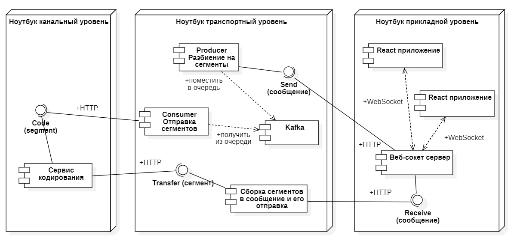
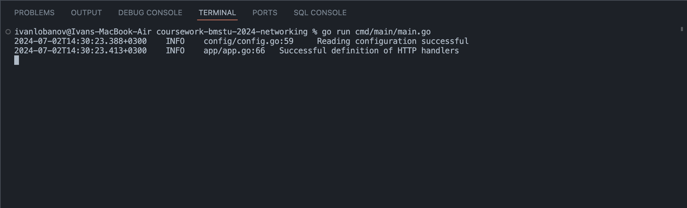

# Курсовая работа по дисциплине "Сети и телекоммуникации"
Разработать распределённую систему для обмена сообщениями в реальном времени, состоящую из трех уровней: прикладной, транспортный и канальный, 
каждый из которых реализуется отдельным веб-сервисом.

## Авторы работы

[Лобанов Иван](https://github.com/cantylv) - Транспортный уровень

[Рыбин Владислав](https://github.com/DemiurgeRV) - Канальный уровень

[Валова София](https://github.com/ssofiica) - Прикладной уровень

## Репозитории с другими уровнями модели ISO/OSI

[Прикладной уровеь](https://github.com/ssofiica/Network-Course-Work) 

[Канальный уровеь](https://github.com/DemiurgeRV/coursework-bmstu2024)

## Диаграмма развертывания

 
## Технические трабования к ПО
1) Версия языка Golang не ниже 1.22
2) Версия Docker не ниже 4.31.0

## Запуск программы 
```
# переходим в корень проекта
# скачиваем все необходимые зависимости
go mod tidy 
# !!!! Примечание ниже
docker compose up -d
go run cmd/main/main.go
```
> Примечание: перед запуском docker compose поменяйте IP-адреса машин, на которых запускаются уровни модели ISO/OSI, порты и endpoint-ы. Также можно поэкспериментировать, поменяв длину сегментов и прочие характеристики транспортного уровня. Чтобы полностью исполнить работу ПО курсовой работы, склонируйте репозитории других уровней и согласуйте все сетевые параметры. Удачи. 

Успешный запуск программы выглядит так:
